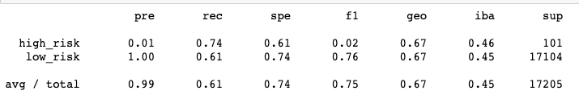
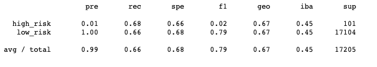
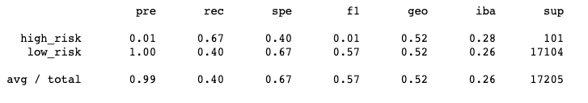
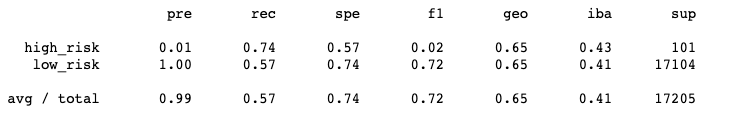
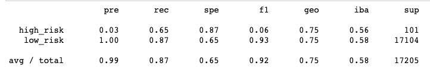
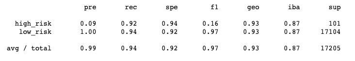

# Credit_Risk_Analysis
comparing supervised machine learning models

## Overview of the analysis: 
The purpose of this analysis is to compare a number of supervised machine learning models in order to determine an applicant's credit risk. We needed to apply machine learning models because there was a class imbalance in the dataset. Out of 68,817 entries 68,470 were low risk. 

## Results:
One way to address this is oversampling, or making the sample size of high risk entries larger.

### 1. RandomOverSampler
The RandomOverSampler duplicates random existing datapoints that are high risk.
Acuracy: 0.6770635552797561

F-Scores:

### 2. SMOTE
The Synthetic Method Oversampling Technique (SMOTE) creates new datapoints based on surrounding datapoints in that class.
Acuracy: 0.6703961322231382

F-Scores:

Methods 3 and 4 rely on undersampling, or decreasing the size of the majority class.

### 3. ClusterCentroid
The ClusterCentroid method synthesizes the data of the majority class and then downsizes the number of datapoints to a smaller set of synthetic data.
Acuracy:0.6703961322231382

F-Scores:

### 4. SMOTEENN
SMOTEENN combines the SMOTE and Edited Nearest Neighbors (ENN) algorithms. SMOTEENN is a two-step process:
- 1. Oversample the minority class with SMOTE.
- 2. Clean the resulting data with an undersampling strategy. If the two nearest neighbors of a data point belong to two different classes, that data point is dropped.

Acuracy: 0.6544957348868656

F-Scores:

Methods 5 and 6 are bootstrap aggregation techniques in which multiple samples are drawn with replacement by classifiers, which then make predictions. One weak learner model is then fit on each data sample. Finally, the predictions from all of the fit weak learners are combined to make a single prediction (e.g. aggregated).

### 5. BalancedRandomForestClassifier
Acuracy: 0.7615432438940808

F-Scores:

### 6. EasyEnsembleClassifier
The idea behind Adaptive Boosting, called AdaBoost, is easy to understand. In AdaBoost, a model is trained then evaluated. After evaluating the errors of the first model, another model is trained. This time, however, the model gives extra weight to the errors from the previous model.

Acuracy: 0.9316600714093861

F-Scores:

## Summary: 

The EasyEnsembleClassifier is the best model to use in this case, with 93% accuracy.
